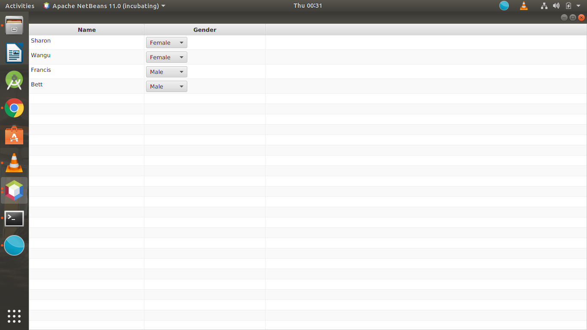

## javafxComboBox-Table

first create an fxml file for the table either through scene buider or the code

```
<?import java.lang.*?>
<?import java.util.*?>
<?import javafx.scene.*?>
<?import javafx.scene.control.*?>
<?import javafx.scene.layout.*?>

<AnchorPane id="AnchorPane" prefHeight="446.0" prefWidth="546.0" xmlns:fx="http://javafx.com/fxml/1" xmlns="http://javafx.com/javafx/2.2" fx:controller="tablecombo.FXMLDocumentController">
  <children>
    <TableView id="table" fx:id="tableView" prefHeight="446.0" prefWidth="546.0" AnchorPane.bottomAnchor="0.0" AnchorPane.leftAnchor="0.0" AnchorPane.rightAnchor="0.0" AnchorPane.topAnchor="0.0">
      <columns>
        <TableColumn maxWidth="5000.0" minWidth="10.0" prefWidth="268.0" text="Name" fx:id="name" />
        <TableColumn maxWidth="5000.0" minWidth="10.0" prefWidth="282.0" text="Gender" fx:id="gender" />
      </columns>
    </TableView>
  </children>
</AnchorPane>
```
create a two classesone for combobox and another for the data you want to enter. for this casei used combobox and table bean

```public class TableBean {
    String name;
    
    ComboBox<String> gender;

    public TableBean(String name, ComboBox<String> gender) {
        this.name = name;
        this.gender = gender;
    }

    public String getName() {
        return name;
    }

    public void setName(String name) {
        this.name = name;
    }

    public ComboBox<String> getGender() {
        return gender;
    }

    public void setGender(ComboBox<String> gender) {
        this.gender = gender;
    }
    
}
````
this one extends the main application
```
public class TableCombo extends Application {
    
    @Override
    public void start(Stage stage) throws Exception {
        Parent root = FXMLLoader.load(getClass().getResource("FXMLDocument.fxml"));
        
        Scene scene = new Scene(root);
        
        stage.setScene(scene);
        stage.show();
    }

    /**
     * @param args the command line arguments
     */
    public static void main(String[] args) {
        launch(args);
    }
    
```
Edit your controller class so as  to call values from the fxml and java class.

```
public class FXMLDocumentController implements Initializable {

    @FXML
    private TableView< TableBean> tableView;

    @FXML
    TableColumn< TableBean, ComboBox> gender;

    @FXML
    TableColumn< TableBean, ComboBox> name;

    ObservableList<TableBean> list = FXCollections.observableArrayList();

    @Override
    public void initialize(URL url, ResourceBundle rb) {
        ComboBox<String> gender_combo = new ComboBox<>();
        gender_combo.getItems().add("Male");
        gender_combo.getItems().add("Female");
        gender_combo.getItems().add("Other");

        ComboBox<String> gender_combo1 = new ComboBox<>();
        gender_combo1.getItems().add("Male");
        gender_combo1.getItems().add("Female");
        gender_combo1.getItems().add("Other");
        list.add(new TableBean("Sharon", gender_combo1));

        ComboBox<String> gender_combo2 = new ComboBox<>();
        gender_combo2.getItems().add("Male");
        gender_combo2.getItems().add("Female");
        gender_combo2.getItems().add("Other");
        list.add(new TableBean("Wangu", gender_combo2));

        ComboBox<String> gender_combo3 = new ComboBox<>();
        gender_combo3.getItems().add("Male");
        gender_combo3.getItems().add("Female");
        gender_combo3.getItems().add("Other");
        list.add(new TableBean("Francis", gender_combo3));

        list.add(new TableBean("Bett", gender_combo));
        
        
        

        tableView.setItems(list);

        gender.setCellValueFactory(new PropertyValueFactory<TableBean, ComboBox>("gender"));
        name.setCellValueFactory(new PropertyValueFactory<TableBean, ComboBox>("name"));
    }

}

```

When you run the project it will populate data for you like this


